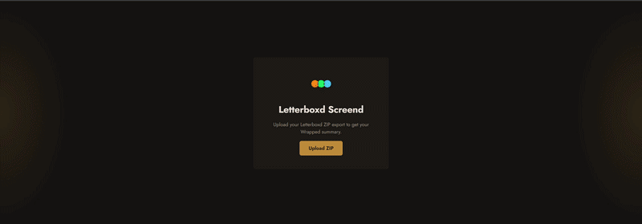

# letterboxd screend

upload your letterboxd data export and get a full breakdown of your watch history. genre trends, director frequency, sentiment analysis on your reviews, rewatch behavior, and a bunch of other stuff you probably didnt ask to know about yourself.

**[try it →](https://ckwlee.github.io/letterboxd-screend)**



---

## what it does

drop in your letterboxd ZIP and it generates 20+ tiles in a warm, cinema-themed dashboard:

- full-width monthly activity timeline
- sentiment analysis on your written reviews
- word cloud from your review language
- calendar heatmap of when you actually watch
- genre and decade breakdowns
- director and actor frequency
- rewatch rating drift (do you rate things higher or lower the second time?)
- binge session detection and viewing streaks
- world map of where your films were produced
- an insights panel that surfaces patterns you didnt notice

no account needed. no data leaves your browser except TMDB metadata lookups.

---

## how it works

```
your browser (React/Vite)
      ↓  parses your ZIP locally
FastAPI backend (Google Cloud Run)
      ↓  enriches with film metadata
TMDB API
```

the frontend does all the heavy lifting client-side — csv parsing, stat calculations, visualizations. the backend exists so the TMDB API key stays off the client.

the warm amber/dark brown color scheme is intentional. it looks like a theater, not a spreadsheet.

---

## stack

| | |
|---|---|
| frontend | React, Vite, D3.js, Recharts, sentiment.js |
| parsing | PapaParse, JSZip |
| backend | FastAPI, Python 3.11 |
| metadata | TMDB API |
| hosting | GitHub Pages + Google Cloud Run |
| ci/cd | GitHub Actions |
| font | Jost (Futura-adjacent) |

---

## run it locally

**frontend**
```bash
npm install
npm run dev
```

add a `.env` in the root:
```
VITE_API_URL=http://localhost:8000
```

**backend**
```bash
cd server
pip install -r requirements.txt
uvicorn main:app --reload
```

add a `server/.env`:
```
TMDB_API_KEY=your_key_here
```

---

## deploy your own

backend on Google Cloud Run:
```bash
cd server
gcloud run deploy letterboxd-screend-api \
  --source . \
  --region us-central1 \
  --allow-unauthenticated \
  --set-env-vars TMDB_API_KEY=your_key_here
```

frontend auto-deploys via GitHub Actions on push to main. add `VITE_API_URL` as a repo secret pointing to your Cloud Run URL.